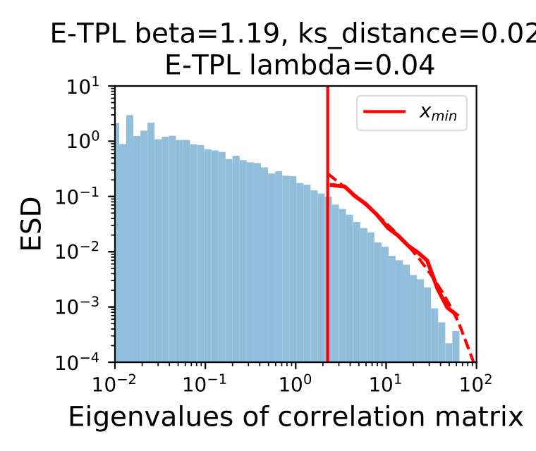

# NLP metrics
This repository contains the code to reproduce the results for the ICLR submission "Evaluating natural language processing models with generalization metrics that do not need access to any training or testing data".

## Setup the environment

Step 1. Create a conda environment.
```
conda env create
```
Activate the environment.
```
conda activate NLP_metrics
```

Step 2. Download data and pretrained results.
```
./download_data.sh
```

## Generate the experiment files. Change the checkpoint repository if necessary.
```
python create_experiment.py --CKPT_DIR <your_checkpoint_directory>
```
For example, on my machine, the checkpoint directory is `/data/user_name/Generalization_metrics_for_NLP/checkpoint/`.

## Reproduce the figures shown in paper

### Result 1. Examples of PL fittings.

You can check the examples of PL and E-TPL fittings. Take a look at `visualization/Visualize_example_WW_layers.ipynb`.



### Result 2. Scatter plots.

Then, you can reproduce the scatter plots that compare the generalization metrics with the BLEU scores. Check `visualization/reproduce_scatterplot.ipynb`.


### Result 3. Box plots.

You can also reproduce the box plots that rank the generalization metrics considered in the paper. 


First, use the following commands to generate the time-wise correlations. The argument `--bleu_type` can be used to choose the correlation with the test BLEU scores or the generalization gap.
```
python time_wise_correlation.py --bleu_type test
python time_wise_correlation.py --bleu_type gap
```

Second, Generate the correlation results when a single hyperparameter is varied.
```
python aggregate_hyperparameter_correlation.py
```

Now, you should have all the results. Check `visualization/calculate_rank_correlation_with_colored_groups.ipynb` to see the box plots.

## Reproduce all the training results.

Fully reproducing our results requires :link: [slurm](https://slurm.schedmd.com/) and about 6T storage.

Step 1. Generate slurm configuration files. Check the `scripts/generate_script.ipynb` to generate the training and evaluation slurm configrations.

Step 2. Submit the slurm files. Remember to change the directories in the slurm file and make a slurm log folder.
```
mkdir slurm_logs
```

For training, do the following.
```
sbatch ./scripts/slurm_train_models.sh
```
For evaluation, use the following bash files.
```
sbatch ./scripts/slurm_eval_bleu.sh
sbatch ./scripts/slurm_compute_ww.sh
sbatch ./scripts/slurm_robust_measures.sh
```
Notice that we evaluate PL, E-TPL and EXP fittings. To select the distribution, change L23-33 in the file `slurm_compute_ww.sh`.

Step 3. After generating all the evaluation files, you will get all the json and pickle files similar to the `checkpoint.zip`. Then, you can draw the scatter plots and calculate the rank correlations using the following commands.
```
./scripts/run_plot_scatterplot.sh
./scripts/run_hyperparameter_correlation.sh
```
After that, you will get all the plots and rank correlation results similar to the `plots.zip` and `results.zip`.