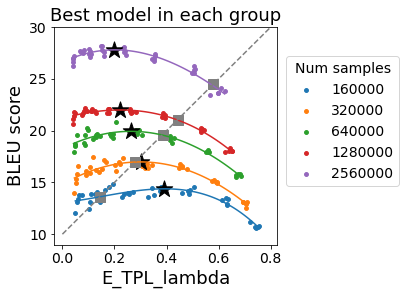
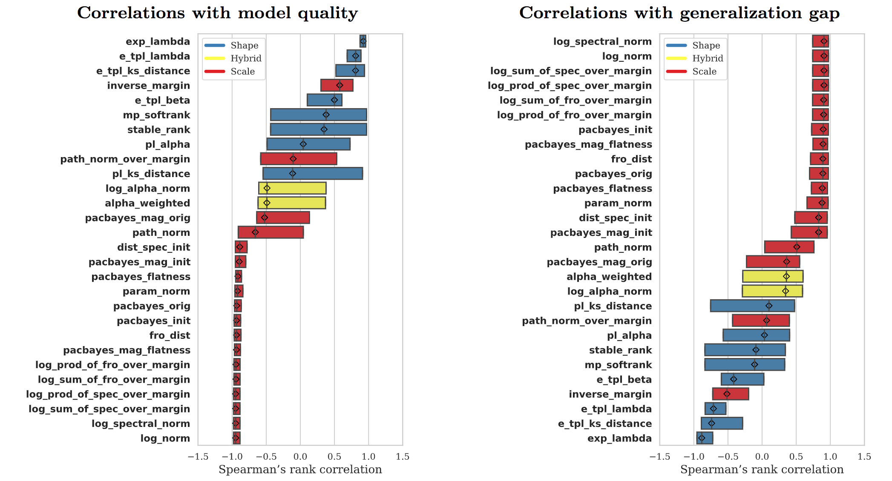

# NLP metrics
This repository contains the code to reproduce the results from the paper :link: [Evaluating natural language processing models with generalization metrics that do not need access to any training or testing data.](https://arxiv.org/pdf/2202.02842.pdf) Our main results are that metrics from the :link: [HT-SR theory](https://github.com/CalculatedContent/WeightWatcher) can predict the generalization of NLP models. Also, unlike existing generalization metrics that focus on the "generalization gap", the HT-SR theory can predict the quality of NLP models, e.g., measured by the test-time BLEU scores when the NLP task is neural machine translation.

We mainly study Transformers in this paper. For Transformer training, we follow :link: [Vaswani et al.](https://arxiv.org/abs/1706.03762). We develop our implementation based on an :link: [online repository](https://github.com/gordicaleksa/pytorch-original-transformer). This code reproduces the results from Vaswani et al. with more easily configurable Transformer architectures. In addition to the HT-SR theory, we also evaluate generalization metrics from :link: [Dziugaite et al. 2020.](https://proceedings.neurips.cc/paper/2020/file/86d7c8a08b4aaa1bc7c599473f5dddda-Paper.pdf) and :link: [Jiang et al. 2019.](https://arxiv.org/abs/1912.02178)

## Setup the environment

Step 1. Create a conda environment.
```
conda env create
```
Activate the environment.
```
conda activate NLP_metrics
```

Step 2. Download data and pretrained results.
```
./download_data.sh
```

## Generate the experiment files.
```
python create_experiments.py
```

## Reproduce the figures shown in paper

### Result 1. Examples of PL fittings.

You can check the examples of PL and E-TPL fittings. Take a look at `visualization/Visualize_example_WW_layers.ipynb`.


### Result 2. Scatter plots.

Then, you can reproduce the scatter plots that compare the generalization metrics with the BLEU scores. Check `visualization/reproduce_scatterplot.ipynb`.



### Result 3. Box plots.

You can also reproduce the box plots that rank the generalization metrics considered in the paper. 



First, use the following commands to generate the time-wise correlations. The argument `--bleu_type` can be used to choose the correlation with the test BLEU scores or the generalization gap.
```
python time_wise_correlation.py --bleu_type test
python time_wise_correlation.py --bleu_type gap
```

Second, Generate the correlation results when a single hyperparameter is varied.
```
python aggregate_hyperparameter_correlation.py
```

Now, you should have all the results. Check `visualization/reproduce_scatterplot.ipynb` to see the box plots.

## Reproduce all the training results.

Fully reproducing our results requires :link: [slurm](https://slurm.schedmd.com/) and about 2T storage.

## Citation

We appreciate it if you would please cite the following paper if you found the repository useful for your work:

```
@TECHREPORT{yang2022evaluating,
  author =       {Yang, Yaoqing and Theisen, Ryan and Hodgkinson, Liam and Gonzalez, Joseph E and Ramchandran, Kannan and Martin, Charles H and Mahoney, Michael W},
  title =        {Evaluating natural language processing models with generalization metrics that do not need access to any training or testing data},
  number =       {Preprint: arXiv:2202.02842},
  year =         {2022},
}
```

License
----

MIT